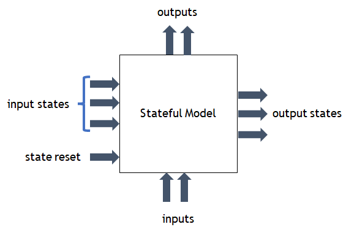

# Triton Stateful Backend

This repository contains the Stateful Backend for Triton Inference Server. You can learn more about backends in the [backend repo](https://github.com/triton-inference-server/backend). Ask questions or report problems in the main Triton [issues page](https://github.com/triton-inference-server/server/issues).

The backend code automatically manages the input and output states of a model. The states are associated with a sequence id and need to be tracked for inference requests associated with the sequence id. The backend currently handles ONNX models, however, it can be extended to other model types. 



The example stateful model above has matching input and output tensors representing the model states. An output state tensor for a sequence id is passed as the input state during the next inference execution of the same sequence id. Therefore, we do not need to communicate the state tensors between server and client, and they can be kept on the GPU (or CPU) memory for GPU (or CPU) execution. The backend code stores the state tensors for all active sequences on the GPU (or CPU) memory and passes the stored state tensors as model input when the sequence id associated with the state tensors has an inference request.

The state tensors are provided in the model configuration file at the `state_pairs` section. For the example model in models/accumulate, the state tensor input and output pairs are specified in the `parameters` section as below:
```
   {
    key: "state_pairs"
    value: { string_value: "<<<Accumulate_In, Accumulate_Out>>>" }
   }
```

During the model instance initialization, the stateful backend reserves GPU (or CPU) memory as large as `max_candidate_sequences * sum_of_all_state_tensor_sizes` to store  model state tensors. 

## How to use?
1. [Build](#building-the-backend) the backend. Run Triton server docker image, and copy the backend files to the triton [backend folder](https://github.com/triton-inference-server/backend#can-i-add-or-remove-a-backend-to-an-existing-triton-installation). Delete existing onnxruntime backend and set the LD_LIBRARY_PATH variable:
 
```
docker run --gpus all -it --rm --shm-size=1g --ulimit memlock=-1 --ulimit stack=67108864 -p8005:8005 -p8006:8006 -p8007:8007 -v${PWD}:/workspace/stateful_backend nvcr.io/nvidia/tritonserver:21.08-py3
rm -rf /opt/tritonserver/backends/onnxruntime # Remove existing ORT backend to avoid having two copies
cp  -R /workspace/stateful_backend/build/install/backends/stateful ./backends/ # Copy the stateful backend
export LD_LIBRARY_PATH=/workspace/stateful_backend/build/ort-lib/ # Add ORT to the LD_LIBRARY_PATH
tritonserver --grpc-port 8005 --model-repository /workspace/stateful_backend/models/ # Run the triton inference server
```

 
2. Create an ONNX model that exposes input and output state tensors. The model
   should also have a mechanism to reset the initial values of state tensors for
   the beginning of the sequence. See the example model for a reference.
 

3. Create a model config file that matches the ONNX model. The model config file
   only needs to have the standard Input and Outputs excluding the state tensors
   listed. The state pairs are listed in the `parameters` section. For the example ONNX model:

```
   {
    key: "state_pairs"
    value: { string_value: "<<<Accumulate_In, Accumulate_Out>>>" }
   }
```

4. We also need a mapping between `CONTROL_SEQUENCE_START` to  `ResetSequence`
   boolean input tensor to reset the values of state tensors. If the boolean input tensor is
   set to `true` for an inference request, the input state values will be ignored and the model will use the 
   initial values of the states stored in the ONNX model file as constants. This mapping allows
   the stateful backend to reset the state tensor values for the start of a sequence. 

```
        {
          name: "ResetSequence"
          control [
            {
              kind: CONTROL_SEQUENCE_START
              int32_false_true: [ 0, 1 ]
            }
          ]
        }
```
    

5. Incorporate the model file in Triton's Model Repository

```
        model_repository
        └── accumulate
            ├── 1
            │   └── accumulate.onnx
            └── config.pbtxt

```

## Building the backend
Run:
```
$ python3 ./build.py
```
The backend binary will be produced in `build/install/backends` directory.

Alternatively, you can do the following steps to build manually (NOTE: we will be using 21.08 NGC containers):
1. Build the custom docker image which we will use to build the backend:
```
$ docker build --tag triton-21.08-backend -f docker/Dockerfile.backend .
```

2. Create a container of the previously built image:
```
$ docker run --gpus all -it --rm --shm-size=1g --ulimit memlock=-1 --ulimit stack=67108864 -v${PWD}:/workspace/stateful triton-21.08-backend
```

3. Inside the container, run the following:
```
$ mkdir -p /workspace/stateful/build && cd /workspace/stateful/build
$ cmake -DCMAKE_INSTALL_PREFIX:PATH=`pwd`/install -DTRITON_BACKEND_REPO_TAG="r21.08" -DTRITON_CORE_REPO_TAG="r21.08" -DTRITON_COMMON_REPO_TAG="r21.08" ..
$ make -j
$ make install
```

## Testing the backend
Run: 
```
$ python3 scripts/test.py
```
It will build the backend, start the tritonserver with the backend, run a simple client with the accumulate model.

## Example Triton model 
models/accumulate folder contains a simple Triton model with state tensors and
reset state boolean input. The ONNX file contains a simple accumulation graph
where the input tensor are summed over the last dimension and added to a running
sum. Stateful Backend keeps track of the running sum value for all sequences and
provides the output state (the running sum) as input to the model when the
corresponding sequence has an inference request.

The model configuration file maps `CONTROL_SEQUENCE_START` signal to
`ResetSequence` model input to initialize the state values with 0 constants that are stored
in the ONNX model. The files and folder structure can be used
to serve similar stateful ONNX models.

## Additional features 
* Stateful backend can do dynamic batching along any tensor dimension. The batch dimension should be marked with -1 in the model configuration file for the input and output tensors. 
* The state tensors can only have one dynamic dimension that is assumed to be the batch dimension. 
* The ONNX model should contain the initial values for the state tensors. `CONTROL_SEQUENCE_START` control input can be mapped to a boolean model input tensor that signals when to reset the initial values of the states.
* `ort_ep` model config parameter to choose the ORT backend between `trt` and `cuda`
* `compute_precision` model config parameter to specify the precision (`fp32` or `fp16`). `fp16` is only supported for ORT `trt` EP.
* `always_pad_to_max_batch` model config parameter to specify whether the batch dimension should be padded to max batch size for model execution (set value to `1`)
* `store_states_as_fp16` model config paramter to specify whether the internal states are stored as FP16 to reduce memory consumption (set value to `1`). However, it may impact the result accuracy.


## Limitations
* Stateful backend only works with ONNX models
* All tensor dimensions except for the batch dimension is fixed for a model instance
* Only float (FP32) state tensors are supported
* Model state reset tensor should be a boolean tensor
* Only `oldest` sequence batching strategy is supported
